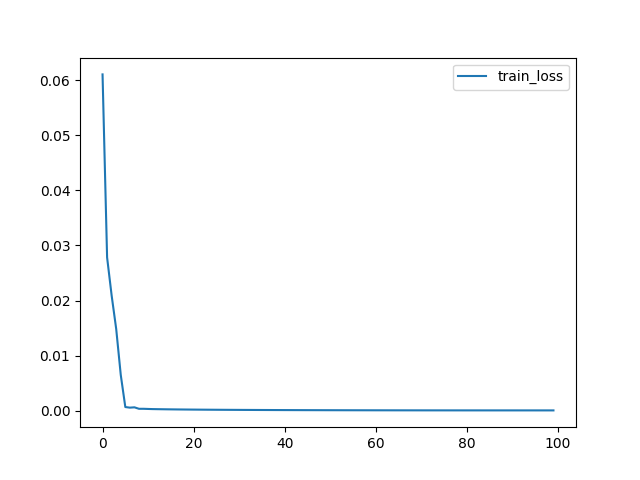
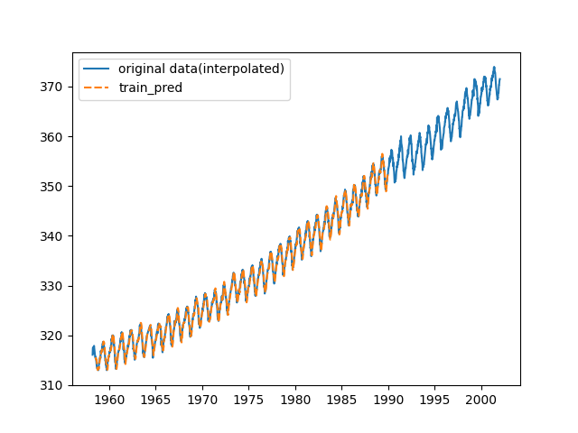
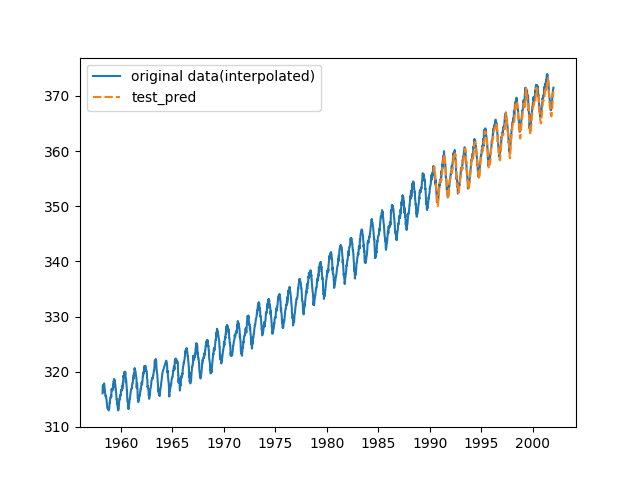

# Implementation GRU model with PyTorch

## Preparing Environment

```
$ docker-compose build
$ docker-compose up -d
# cd /work
```

## Time-series forecasting

Training GRU model to predict atmospheric CO2 dataset with PyTorch.

### Usage

```
$ python3 main.py
```

#### Train result

Trained model is saved to output directory (default is ``./output``).

```
=================================================================
Layer (type:depth-idx)                   Param #
=================================================================
GRU                                      --
├─GRU: 1-1                               12,864
├─Linear: 1-2                            65
=================================================================
Total params: 12,929
Trainable params: 12,929
Non-trainable params: 0
=================================================================
Epoch: 0001, train loss: 0.06106011
Epoch: 0101, train loss: 0.00032518
Epoch: 0201, train loss: 0.00020856
Epoch: 0301, train loss: 0.00015500
Epoch: 0401, train loss: 0.00012066
Epoch: 0501, train loss: 0.00009716
Epoch: 0601, train loss: 0.00008145
Epoch: 0701, train loss: 0.00007107
Epoch: 0801, train loss: 0.00006579
Epoch: 0901, train loss: 0.00006389
```



#### Evaluation result

- Train MSE: 6.285544529584274e-05

- Test MSE: 0.00015856578690138335

